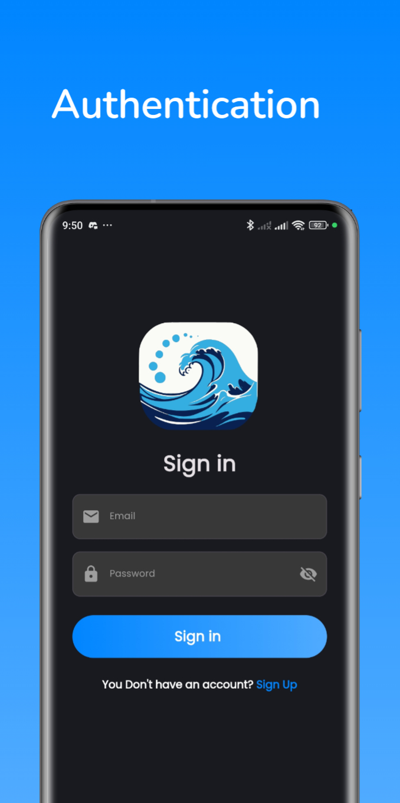
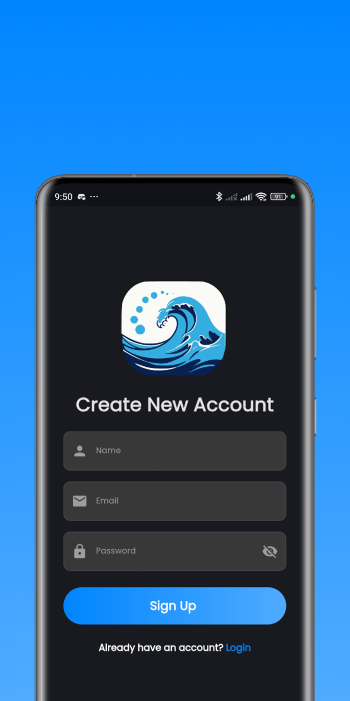
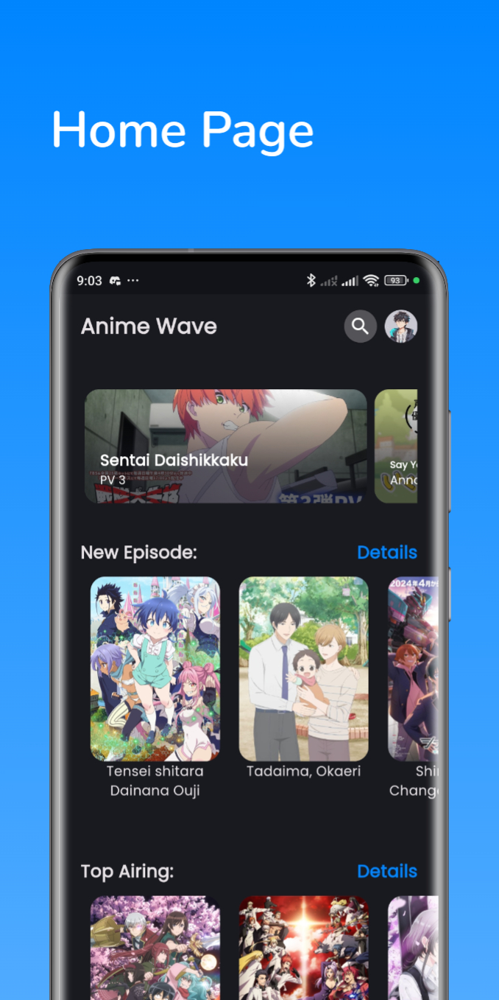
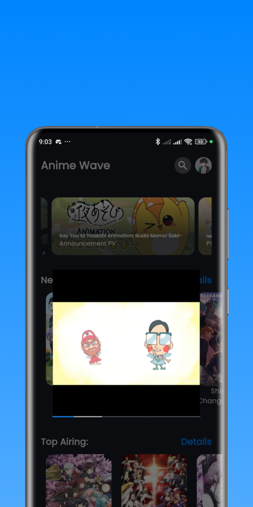
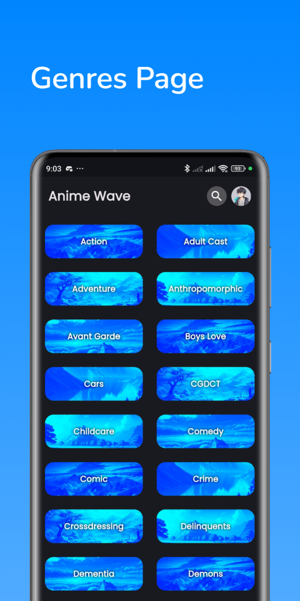
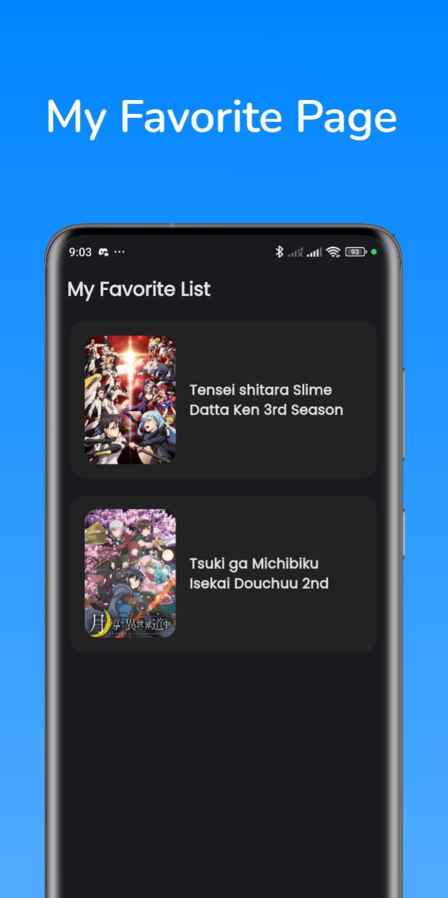
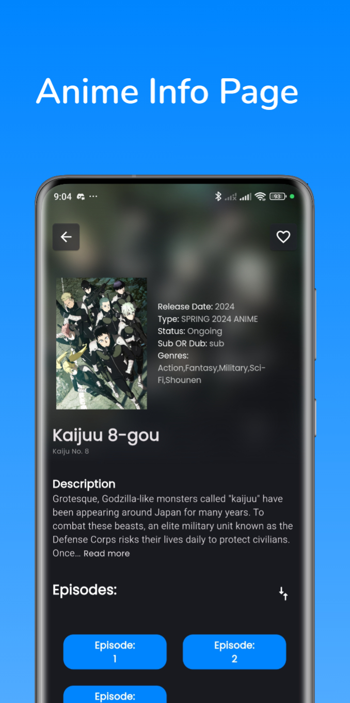
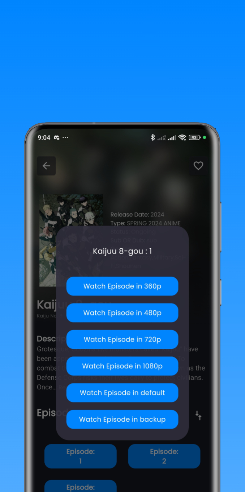
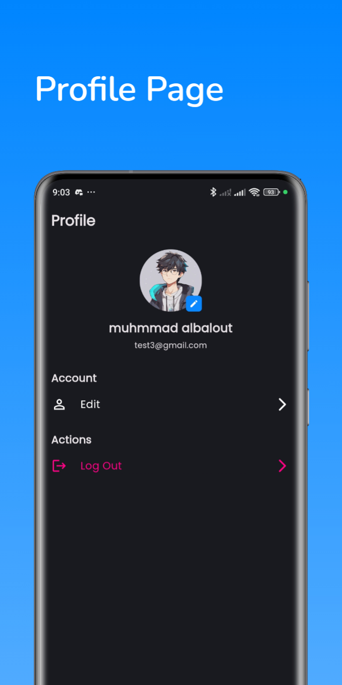
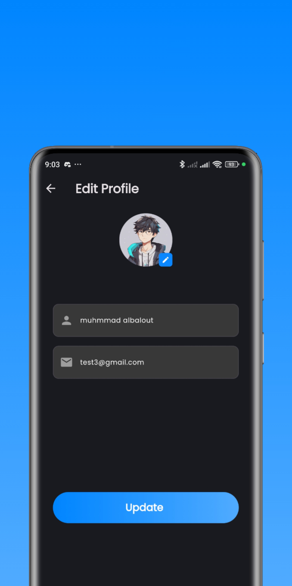

  
  <h1>Anime Wave</h1>

Anime Wave is a feature-rich app for streaming anime content.
It provides a wide selection of anime series, movies, and OVAs from various genres, allowing users to enjoy their favorite shows on-demand.
  

# :star2: Screenshots

## Sign in & Sign Up Page

## :dart: Features
- Authentication: The app utilizes Supabase Authentication to provide a secure and user-friendly sign-up and sign-in experience.

## Home Page

## :dart: Features
- Episodes Showcase: The app includes a dedicated section that showcases the newest anime episodes and top airing episodes.
- Promos Section: The app features a dedicated section that showcases promos for new anime episodes or upcoming shows.
- Anime Search: The app allows users to search for anime by their titles, providing relevant search results for quick and easy access to specific shows.

## Genres Page & My Favorite Page

## :dart: Features
- Genre Browse: The app provides users with a list of available genres to browse. Users can select a genre of their choice to explore anime titles that belong to that genre, allowing for a personalized browsing experience.
- Favorites Page: The app features a dedicated page where users can view all their favorite anime shows. This page allows users to easily access and manage their preferred shows,The user's favorite shows are stored in a Supabase database, ensuring that their preferences are saved and can be accessed across multiple devices.

## Anime Info Page

## :dart: Features
- Anime Info and Description: The app provides detailed information and descriptions for each anime.
- Anime Episodes and Quality: The app allows users to watch anime episodes within the platform. Users can choose from a list of available episodes for each anime and select their preferred video quality.

## Profile Page Page

## :dart: Features
- User Profile and Account Management: The app allows users to view and update their account information, including personal details and avatar customization.
## Video Player

## Features
Anime Wave offers the following features:
- Browse and search for movies and series
- View detailed information about movies and series
- Stream and watch movies and series directly in the app
- Mark movies and series as favorites for easy access

