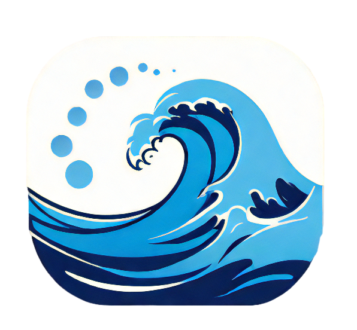
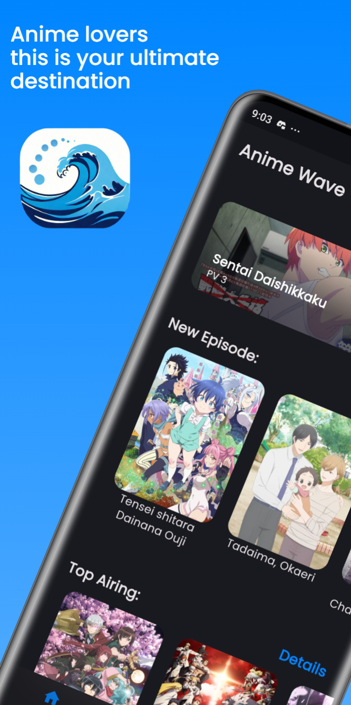
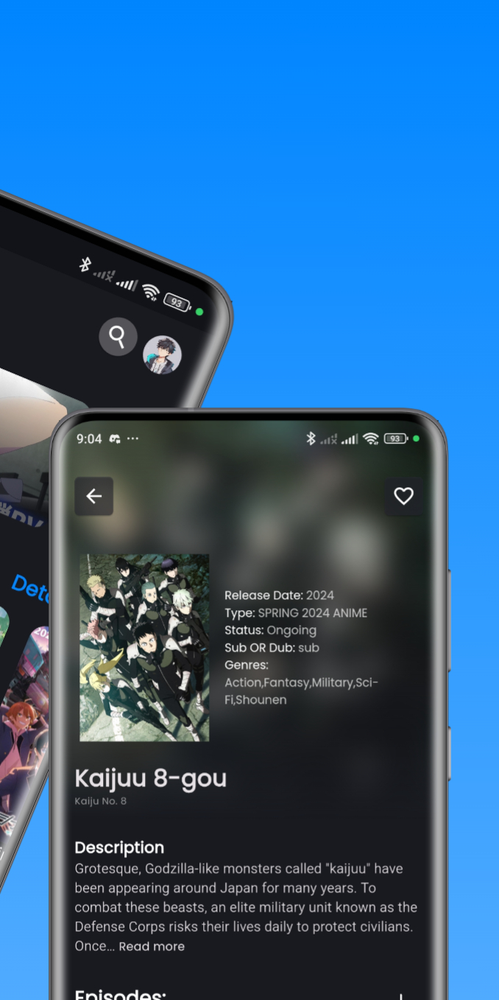

  
  <h1>Anime Wave</h1>

Anime Wave is a feature-rich app for streaming anime content.
It provides a wide selection of anime series, movies, and OVAs from various genres, allowing users to enjoy their favorite shows on-demand.
  

## Sign in & Sign Up Page

  
&nbsp; &nbsp; &nbsp; &nbsp;
  

## Main Page

  
&nbsp; &nbsp; &nbsp; &nbsp;
  

## Genres Page & My Favorite Page

  
&nbsp; &nbsp; &nbsp; &nbsp;
  

## Anime Info Page

  
&nbsp; &nbsp; &nbsp; &nbsp;
  

## Profile Page Page

  
&nbsp; &nbsp; &nbsp; &nbsp;
  

## Video Player

## Features
Anime Wave offers the following features:
- Browse and search for movies and series
- View detailed information about movies and series
- Stream and watch movies and series directly in the app
- Mark movies and series as favorites for easy access

